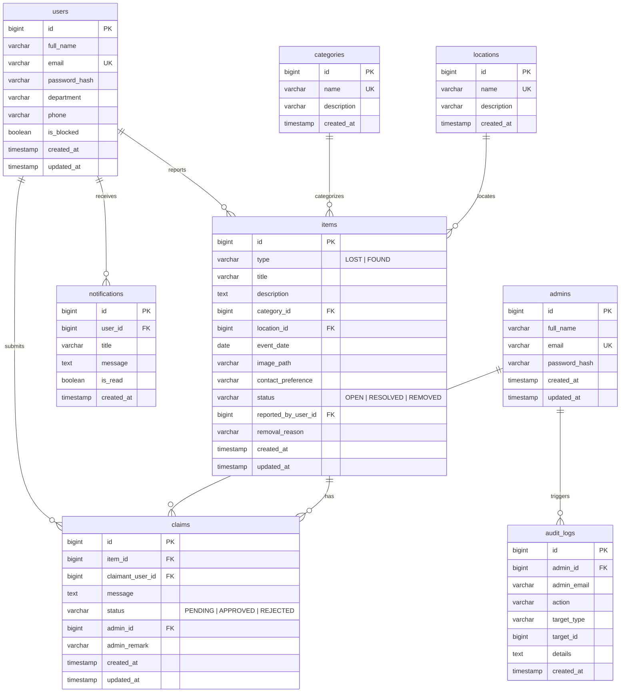

# Campus Lost and Found Portal - Entity Relationship Diagram

```mermaid
erDiagram
    users ||--o{ items : "reports"
    users ||--o{ claims : "submits"
    users ||--o{ notifications : "receives"
    admins ||--o{ claims : "reviews"
    admins ||--o{ audit_logs : "triggers"
    categories ||--o{ items : "categorizes"
    locations ||--o{ items : "locates"
    items ||--o{ claims : "has"

    users {
        bigint id PK
        varchar full_name
        varchar email UK
        varchar password_hash
        varchar department
        varchar phone
        boolean is_blocked
        timestamp created_at
        timestamp updated_at
    }

    admins {
        bigint id PK
        varchar full_name
        varchar email UK
        varchar password_hash
        timestamp created_at
        timestamp updated_at
    }

    categories {
        bigint id PK
        varchar name UK
        varchar description
        timestamp created_at
    }

    locations {
        bigint id PK
        varchar name UK
        varchar description
        timestamp created_at
    }

    items {
        bigint id PK
        varchar type "LOST | FOUND"
        varchar title
        text description
        bigint category_id FK
        bigint location_id FK
        date event_date
        varchar image_path
        varchar contact_preference
        varchar status "OPEN | RESOLVED | REMOVED"
        bigint reported_by_user_id FK
        varchar removal_reason
        timestamp created_at
        timestamp updated_at
    }

    claims {
        bigint id PK
        bigint item_id FK
        bigint claimant_user_id FK
        text message
        varchar status "PENDING | APPROVED | REJECTED"
        bigint admin_id FK
        varchar admin_remark
        timestamp created_at
        timestamp updated_at
    }

    notifications {
        bigint id PK
        bigint user_id FK
        varchar title
        text message
        boolean is_read
        timestamp created_at
    }

    audit_logs {
        bigint id PK
        bigint admin_id FK
        varchar admin_email
        varchar action
        varchar target_type
        bigint target_id
        text details
        timestamp created_at
    }
```
